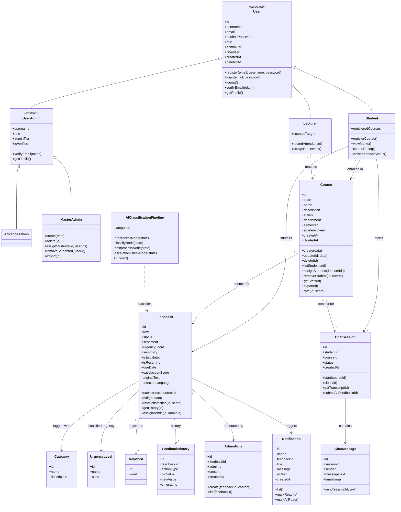

# Portfolio UML Class Diagram

This Mermaid version follows the final project UML while correcting the duplicated `ChatMessage` label that was intended to represent `AdminNote`.

```mermaid
classDiagram
    class User {
        <<abstract>>
        +id
        +username
        +email
        +hashedPassword
        +role
        +adminTier
        +isVerified
        +createdAt
        +deletedAt
        +register(email, username, password)
        +login(email, password)
        +logout()
        +verifyEmail(token)
        +getProfile()
    }

    class Student {
        +registeredCourses
        +registerCourse()
        +viewMarks()
        +courseRating()
        +viewFeedbackStatus()
    }

    class UserAdmin {
        <<abstract>>
        +username
        +role
        +adminTier
        +isVerified
        +verifyEmail(token)
        +getProfile()
    }

    class AdvanceAdmin

    class MasterAdmin {
        +create(data)
        +delete(id)
        +assignStudents(id, userIds)
        +removeStudent(id, userId)
        +export(id)
    }

    class Lecturer {
        +coursesTaught
        +recordAttendance()
        +assignHomework()
    }

    class Course {
        +id
        +code
        +name
        +description
        +status
        +department
        +semester
        +academicYear
        +createdAt
        +deletedAt
        +create(data)
        +update(id, data)
        +delete(id)
        +listStudents(id)
        +assignStudents(id, userIds)
        +removeStudent(id, userId)
        +getStats(id)
        +export(id)
        +rate(id, score)
    }

    class Feedback {
        +id
        +text
        +status
        +sentiment
        +urgencyScore
        +summary
        +isEscalated
        +isRecurring
        +dueDate
        +satisfactionScore
        -originalText
        -detectedLanguage
        +submit(text, courseId)
        +edit(id, data)
        +rateSatisfaction(id, score)
        +getHistory(id)
        +assignAdmin(id, adminId)
    }

    class Category {
        +id
        +name
        +description
    }

    class Keyword {
        +id
        +word
    }

    class UrgencyLevel {
        +id
        +name
        +score
    }

    class FeedbackHistory {
        +id
        +feedbackId
        +actionType
        +oldValue
        +newValue
        +timestamp
    }

    class Notification {
        +id
        +userId
        +feedbackId
        +title
        +message
        +isRead
        +createdAt
        +list()
        +markRead(id)
        +markAllRead()
    }

    class ChatSession {
        +id
        +studentId
        +courseId
        +status
        +createdAt
        +start(courseId)
        +close(id)
        +getTranscript(id)
        +submitAsFeedback(id)
    }

    class ChatMessage {
        +id
        +sessionId
        +sender
        +messageText
        +timestamp
        +send(sessionId, text)
    }

    class AdminNote {
        +id
        +feedbackId
        +adminId
        +content
        +createdAt
        +create(feedbackId, content)
        +list(feedbackId)
    }

    class AIClassificationPipeline {
        -categories
        -preprocessNode(state)
        -classifyNode(state)
        -postprocessNode(state)
        -escalationCheckNode(state)
        +run(text)
    }

    User <|-- Student
    User <|-- UserAdmin
    User <|-- Lecturer
    UserAdmin <|-- AdvanceAdmin
    UserAdmin <|-- MasterAdmin

    Student "*" --> "*" Course : enrolled in
    Lecturer "*" --> "*" Course : teaches
    Student "1" --> "*" Feedback : submits
    Course "1" --> "*" Feedback : context for
    Feedback "*" --> "*" Category : tagged with
    Feedback "*" --> "1" UrgencyLevel : classified urgency
    Feedback "1" --> "*" Keyword : keywords
    Feedback "1" --> "*" FeedbackHistory : history
    Feedback "1" --> "*" AdminNote : annotated by
    Feedback "1" --> "*" Notification : triggers
    Student "1" --> "*" ChatSession : starts
    Course "1" --> "*" ChatSession : context for
    ChatSession "1" --> "*" ChatMessage : contains
    AIClassificationPipeline ..> Feedback : classifies
```
